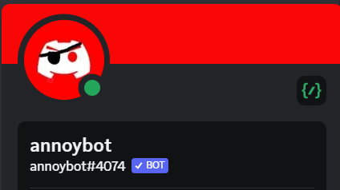
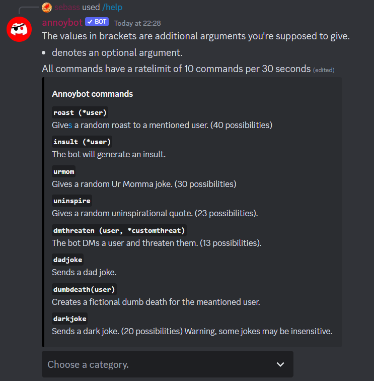
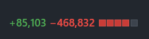

## Annoybot

Apr 2021-Apr 2023 (last update)

Fig. 1: Bot logo

A discord.py bot, written partially in Java. This bot is designed to boost server engagement on discord through trolling and memes.

### About

As one of my first projects, Annoybot was meant to to create unique experiences in friendgroup-focused discord servers, through light teasing and joking. Originally just a one-off thing to play with in my discord server, Annoybot now is mildly popular on discord with over 1400 servers utilising this bot.

Fig. 2: Help page, showing a few core features 

With ~40 commands, each with unique behaviour ranging from generting a dad joke to an interactive memory game, Annoybot is intended to be an interactive, fun method of getting to know your friends on discord better. 

Over the lifespan of the bot, I've also gathered positive feedback:
- "This bot is a hidden gem" ~.terminallycapricious. 
- "I absolutely love (the) bot tho" ~sol666_
- "If this project were to continue, I would be open to sponsor it" ~anonymous

### Learning takeaways

As one of the first "proper" projects, Annoybot was something I was proud of. However, I made many mistakes and am very greatful for being able to heve the opportunity to learn from them. Without delving into the specifics, there were to main aspects in which I gained insight into over the development of the bot.

1. Technical Debt and Bad Practice

My first attempt at building a database was a rough one. Embarassingly, I decided to utilise a plaintext file to read and write user data onto it. What I didn't realise then was that this solution was not scalable and was very prone to corruption. In 1 month alone I had to manually rollback corrupted files every day which was very frustrating. Ultimately rewriting the entire system to use SQL was probably the best thing I did, which taught me to consider scalability as a main factor in my future projects.

2. Out of Control Discord Changes

In 2022, Discord annouced changes to its bot ecosystem, by restricting access to message content. This forced many (if not all) bots, including mine, to be rewritten to comply with the new 'slash command' standard.

Fig. 3: The rewrite diff in the PR I merged

This caused me to spend 2 weeks painfully trawling through old code and rewriting all the code with the new supported features (buttons, selects, slash command functionality). This was worsened by the fact that my code quality was really awful! One key takeaway from this was that my future code had to be maintainable, and that nothing stays the same forever on developing social media sites on Discord.

### Conclusion
This bot is one born out of curiousity and passion. When the idea first came into my head at 14, I had no idea that this bot would inspire me to continue learning how to code as well as motivate me to develop with the idea of being user-focused. View the source code [here](https://github.com/SebassNoob/bot). (some git history was lost because I screwed up my commit order)

